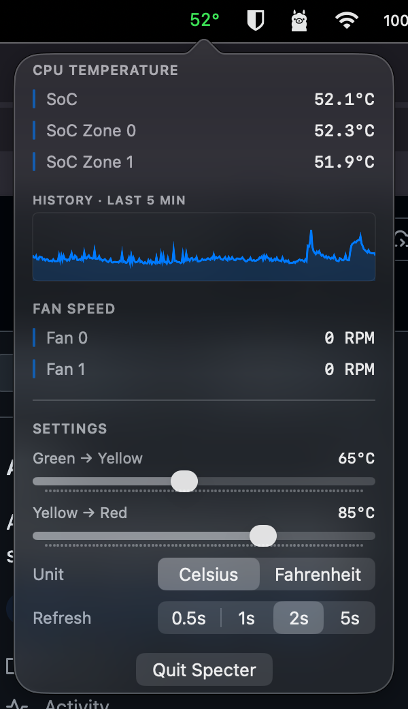

# Specter

A native macOS menu bar app that shows system telemetry at a glance — CPU temperature, per-core breakdown, and fan RPM, with color-coded thresholds and a short history chart.

The app has no Dock icon, no main window, and no chrome. Click the menu bar numeric to see the popover with per-core temps, a 5-minute history chart, and color-threshold settings.



## Build

Requires Xcode 15+ and macOS 13+.

### One-time setup

This project uses [SMCKit](https://github.com/srimanachanta/SMCKit) via Swift Package Manager. Add it to the project from the Xcode UI:

1. Open `Specter.xcodeproj`.
2. **File → Add Package Dependencies…**
3. Paste `https://github.com/srimanachanta/SMCKit` and click **Add Package**.
4. Pick the **Up to Next Major** version rule starting at `1.1.0`.
5. When prompted to choose package products, add **`SMCKit`** to the `Specter` target.
6. Build & run (`⌘R`).

After this one-time step the project is self-contained and rebuilds fine from the command line:

```sh
xcodebuild -project Specter.xcodeproj -scheme Specter -configuration Debug build
```

## What you should see

- A numeric CPU temperature in the menu bar, e.g. `65°`, colored green / yellow / red by the configured thresholds.
- The app does not appear in the Dock or `⌘Tab`.
- Click the menu bar numeric to open a popover with:
  - Per-core CPU temperatures
  - A 5-minute history chart for the primary core
  - Fan RPMs (hidden on Macs without fans, e.g. MacBook Air)
  - A **Settings** section: two sliders for the green→yellow and yellow→red thresholds, plus a °C / °F unit toggle
  - A **Quit Specter** button

## Run as a standalone app on this Mac

For personal use, no signing or notarization is required — Xcode's default "Sign to Run Locally" identity is enough.

```sh
# Build a Release binary
xcodebuild -project Specter.xcodeproj -scheme Specter -configuration Release build

# Link it into /Applications so it's stable across rebuilds
ln -sf ~/Library/Developer/Xcode/DerivedData/Specter-cojnreaiwmjnpgdolqhjyisxslkv/Build/Products/Release/Specter.app /Applications/Specter.app

# Launch it
open /Applications/Specter.app
```

The first launch may show a Gatekeeper prompt about an unidentified developer. Right-click the app in Finder → **Open** to bypass it once; macOS remembers the choice.

To launch Specter at login: **System Settings → General → Login Items → +** → add Specter.

## Verifying the reading

Compare against `powermetrics` (requires `sudo`):

```sh
sudo powermetrics -s smc -i 1000 -n 1 | grep -i "CPU die temperature"
```

The menu bar value should agree within ±2 °C.

## Settings persistence

Settings live in `UserDefaults` under the `com.specter.app` domain. To inspect them:

```sh
defaults read com.specter.app
```

Keys:
- `greenYellowThreshold` — Double, stored in °C
- `yellowRedThreshold` — Double, stored in °C
- `unit` — String, `"C"` or `"F"`

To reset to defaults:

```sh
defaults delete com.specter.app
```

## Architecture

```
App/         — AppDelegate (AppKit entry point) + Info.plist (LSUIElement = YES)
SMC/         — SMCKit key constants (Tp09, Tp01, F0Ac, …)
Telemetry/   — TelemetryProvider protocol, SampleStore ring buffer,
               TelemetryService (1 Hz timer), CPUTemperatureProvider, FanSpeedProvider
Popover/     — PopoverView, PopoverViewModel, SettingsSection, MetricRow, SparklineChart
Settings/    — Settings value type + SettingsStore (UserDefaults wrapper)
UI/          — MenuBarController (NSStatusItem), PopoverController (NSPopover)
```

The data flow is: `TelemetryService` ticks once per second, calls each provider's async `sample()`, appends to a per-provider `SampleStore`, and fires `onUpdate`. `MenuBarController` reads the latest sample to redraw the menu bar; `PopoverViewModel` reads the same store to build immutable snapshots for the popover. No mutable state crosses the boundary into SwiftUI — the view tree only sees `ProviderSnapshot` values, and re-renders are triggered by `@Published` mutations on the view model.